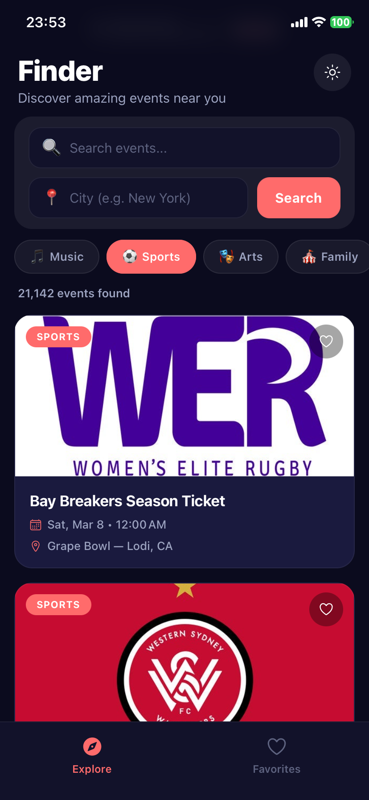
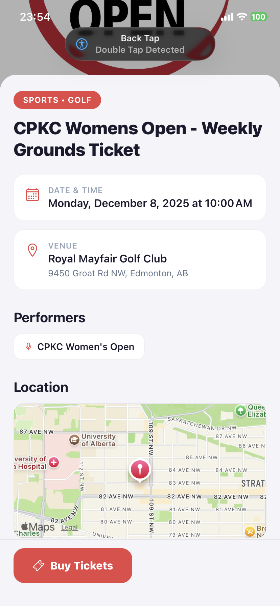
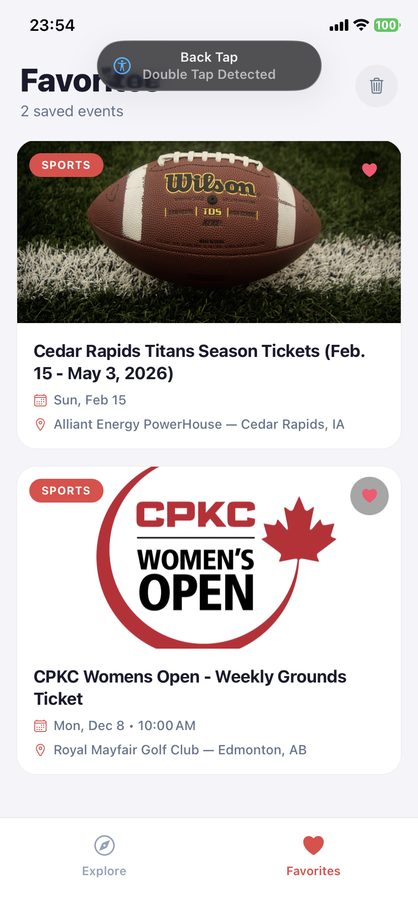

# LiveFinder

LiveFinder is a React Native mobile app for discovering live events (music, sports, arts, and more) using the Ticketmaster Discovery API.

Core features:
- Search by keyword and city
- Explore upcoming events in a paginated list
- View detailed event information with map and ticket link
- Favorite/unfavorite events and persist them locally with MMKV
- Dark/light theme toggle

## Screenshots

| Explore | Event Details | Favorites |
| --- | --- | --- |
|  |  |  |

## Tech Stack

- React Native 0.85.1 (TypeScript)
- React Navigation (Stack + Bottom Tabs)
- Redux Toolkit + RTK Query
- react-native-mmkv for local persistence
- react-native-maps for venue map rendering
- Reanimated for UI transitions/interactions
- Jest + React Native testing setup

## Project Structure

```text
src/
	api/            # RTK Query API slices (Ticketmaster)
	components/     # Reusable UI components
	config/         # App/API configuration
	navigation/     # Stack + tab navigation
	screen/         # Explore, Event detail, Favorites
	store/          # Redux store and slices
	theme/          # Theme provider and color tokens
	types/          # TypeScript domain types
	utils/          # MMKV storage helpers
```

## Setup Instructions

### 1) Prerequisites

- Node.js >= 22.11.0
- Yarn 1.x
- React Native Android/iOS environment configured

Reference: https://reactnative.dev/docs/set-up-your-environment

### 2) Install dependencies

```bash
yarn install
```

### 3) Configure environment variables

Copy `.env.example` to `.env` and provide valid keys:

```bash
cp .env.example .env
```

Required variables:
- `TICKETMASTER_API_KEY`
- `MAPS_API_KEY`

### 4) Android map key setup

Option A (recommended for local Android): set `MAPS_API_KEY` in `android/local.properties`.

```bash
cp android/local.properties.example android/local.properties
```

Update values:
- `sdk.dir`
- `MAPS_API_KEY`

Option B: keep `MAPS_API_KEY` in `.env` (already supported by Gradle fallback).

### 5) iOS pods (macOS only)

```bash
bundle install
bundle exec pod install --project-directory=ios
```

### 6) Run the app

Start Metro:

```bash
yarn start
```

In a second terminal:

Android

```bash
yarn android
```

iOS

```bash
yarn ios
```

## Testing

Run tests:

```bash
yarn test --watch=false
```

Current tests cover core state/storage behavior:
- `__tests__/eventsSlice.test.ts`
- `__tests__/favoritesSlice.test.ts`
- `__tests__/storage.test.ts`

## Implementation Decisions

### 1) Data fetching with RTK Query

Why:
- Built-in caching, request lifecycle flags, and simpler API state management.
- Pagination is handled with RTK Query cache merge logic in `searchEvents`, enabling infinite scroll behavior.

Tradeoff:
- Slightly more setup than plain fetch, but better long-term consistency and scalability.

### 2) Redux Toolkit for app state

Why:
- Search criteria (keyword/city/category/page) and favorites are global concerns shared across screens.
- Predictable updates and easier testing.

### 3) MMKV for local favorites persistence

Why:
- Fast, lightweight native key-value storage for mobile.
- Suitable for favorites and theme preferences.

### 4) Stack + Tabs navigation model

Why:
- Tab navigation is natural for Explore/Favorites switching.
- Stack screen for Event Detail keeps deep navigation clean and mobile-friendly.

### 5) Event detail map with react-native-maps

Why:
- Native map rendering with marker support.
- Integrates cleanly with venue coordinates from Ticketmaster event payloads.

### 6) Resilience and UX states

Implemented states:
- Loading
- Empty results
- Error + retry
- Pull-to-refresh
- Pagination footer loader

This improves reliability for real-world network/API conditions.

## API Notes

- Ticketmaster endpoint used: `/events.json`
- Additional details endpoint: `/events/{eventId}.json`
- Query params include `city`, `keyword`, `classificationName`, `size`, `page`, and `sort`.

